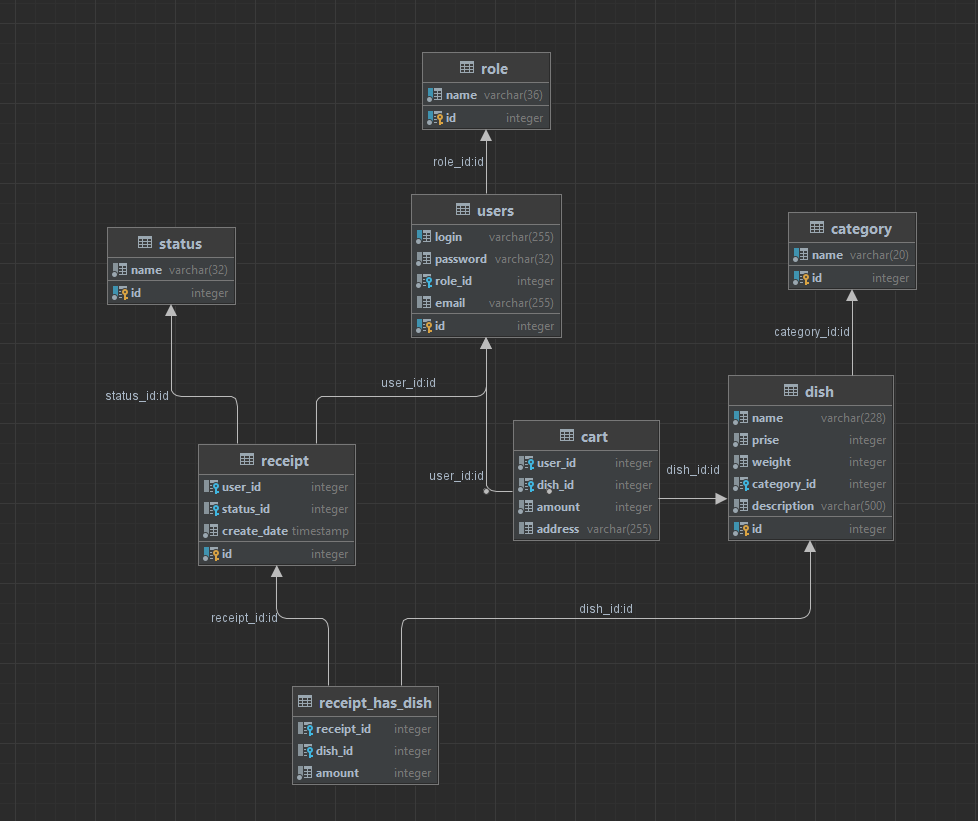
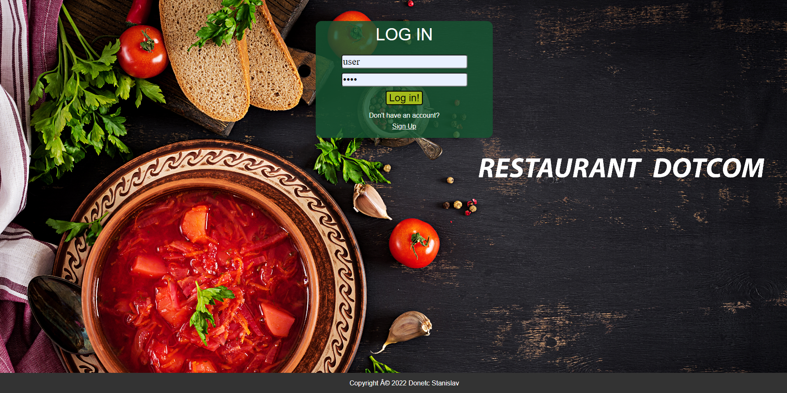
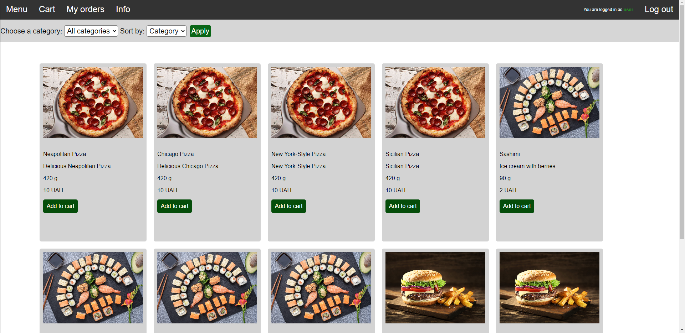
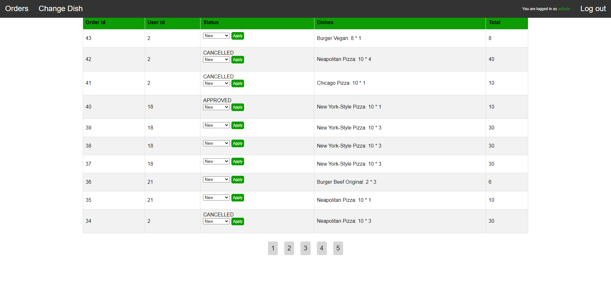
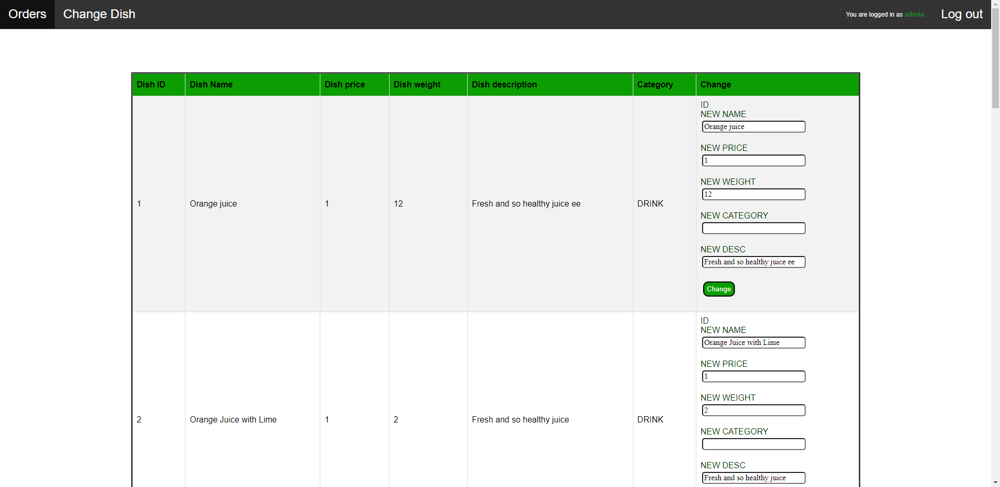

#
Restaurant
=
---
This project was created for EPAM Java external course final project

---
##
There are two user roles:
-----------
    Client can view a menu with the ability to sort (by name, category and price)
    and filter (by category) dishes. 
    Clients also can make orders and view a list of their orders.  

-----------
    Manager can view all orders and update their status.

###
Project description
-----------

        The goal of the final project is to develop a WEB application that supports functionality 
        according to task. Information on the subject is stored in a relational database (PostgraSQL).
        JDBC API was used to access the data. The application architecture conforms MVC pattern. 
        When implementing business logic were used design patterns: Singleton (for ConnectionManager), 
        Chain of Responsibility (HTTP Filters) also factory for command. Apache Tomcat was used as a servlet container.

###
UI for clients
-----

###
UI for manager
----

